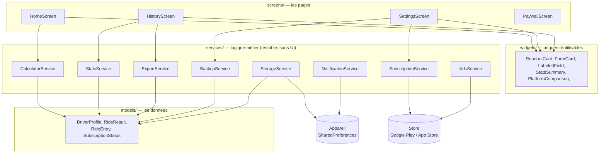
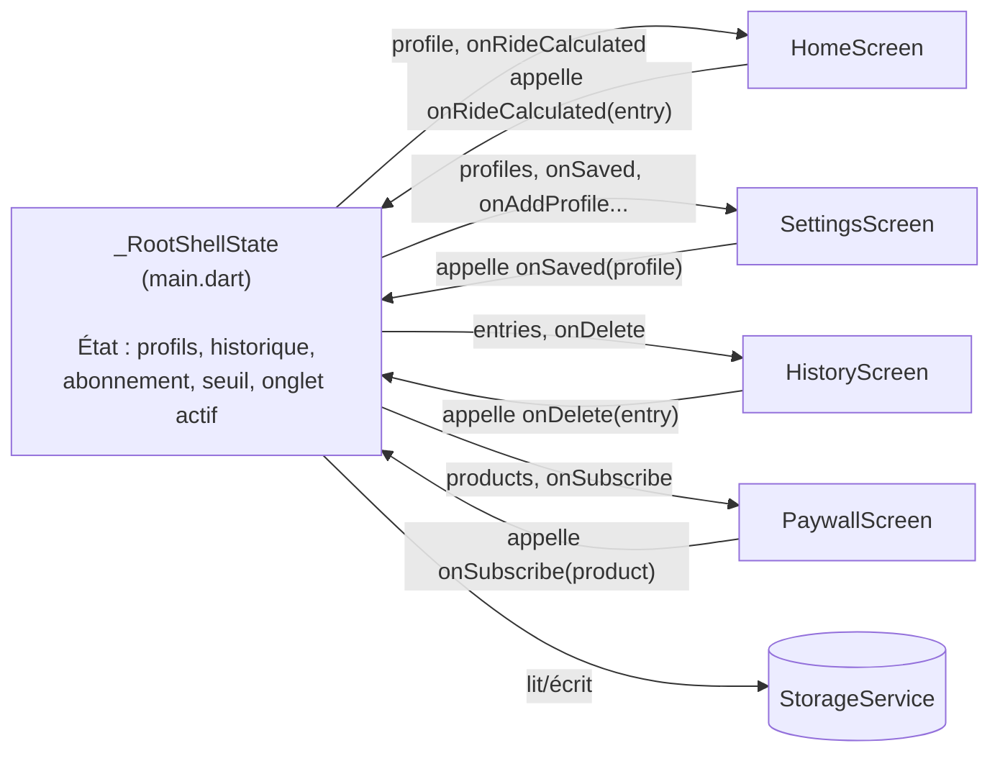
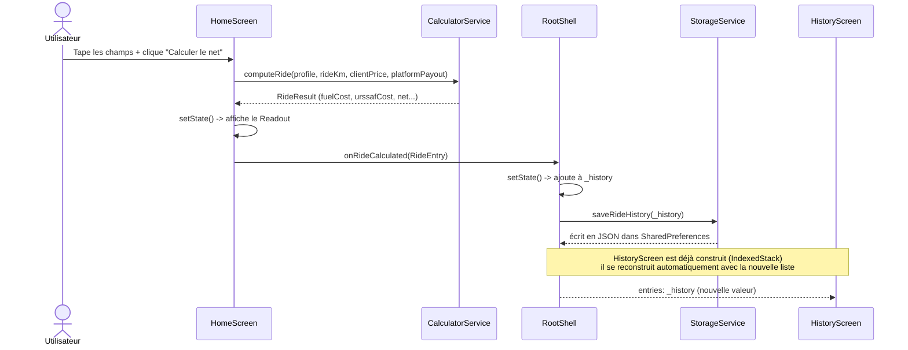

# Architecture de Renta VTC — guide pédagogique

Ce document explique **comment le projet est construit** et **comment les fichiers
communiquent entre eux**, fichier par fichier. Il complète `CLAUDE.md` (qui décrit *quoi*
construire) et `README.md` (qui décrit *comment lancer* le projet) — ici, on explique
*comment ça marche à l'intérieur*, comme si tu découvrais le code pour la première fois.

---

## 1. Le principe de base : 5 dossiers, 5 rôles

Tout le code vit dans `lib/`, découpé en 5 dossiers qui ont chacun **une seule
responsabilité**. C'est la règle la plus importante du projet (voir `CLAUDE.md` §12) :

| Dossier | Rôle | Analogie |
|---|---|---|
| `models/` | Décrire les **données** (quelles infos, quels champs) | Les noms dans une phrase |
| `services/` | La **logique métier pure** (calculs, règles, lecture/écriture disque) | Les verbes — ce qui *fait* quelque chose |
| `screens/` | Les **pages** de l'app (une par onglet) | Les pièces d'une maison |
| `widgets/` | Des **petits morceaux d'UI réutilisables** (un bouton, une carte, une puce) | Les meubles qu'on retrouve dans plusieurs pièces |
| `theme/`, `utils/` | Couleurs/polices, et petites fonctions utilitaires (formatage) | La peinture et la boîte à outils |

**Règle d'or du projet** : un `screen` ne calcule jamais rien lui-même — il appelle un
`service`. Ça permet de tester toute la logique (`test/`) sans jamais avoir besoin
d'afficher un écran. Regarde par exemple `test/calculator_service_test.dart` : il teste
`CalculatorService` tout seul, sans lancer l'app.

---

## 2. Diagramme : les couches du projet

**Comment lire ce diagramme** : les flèches vont "vers le bas" — un écran dépend des
widgets et des services, un service dépend des modèles, un service peut parler à
l'appareil ou à un store externe. **Jamais l'inverse** : un `model` ne sait pas qu'un
`screen` existe, un `service` ne sait pas *quel* écran l'appelle. C'est ce qui rend
chaque brique testable et remplaçable indépendamment.

---

## 3. Qui possède les données ? `RootShell`, le chef d'orchestre

Le projet n'utilise **aucune librairie de state management** (pas de Provider, Riverpod,
Bloc — voir `CLAUDE.md` §2). À la place, il utilise un pattern simple mais qu'il faut bien
comprendre : **"lift state up"** (faire remonter l'état).

Toutes les données de l'app (profils véhicule, historique, abonnement, seuil...) vivent
à un seul endroit : `_RootShellState`, dans `main.dart`. Les écrans ne stockent **aucune**
donnée durable eux-mêmes — ils reçoivent tout en paramètres, et remontent les actions de
l'utilisateur via des callbacks (des fonctions passées en paramètre, appelées quand
quelque chose se passe).

**En clair** : les données descendent (props), les événements remontent (callbacks). Un
écran ne modifie jamais l'état directement — il *demande* à `RootShell` de le faire, et
c'est `RootShell` qui appelle `setState()` puis persiste via `StorageService`.

C'est pour ça que chaque écran (`HomeScreen`, `SettingsScreen`, `HistoryScreen`,
`PaywallScreen`) reçoit une longue liste de paramètres dans son constructeur : ce sont
exactement les données dont il a besoin, plus les fonctions à appeler pour signaler une
action utilisateur.

---

## 4. Exemple concret : que se passe-t-il quand tu cliques sur "Calculer le net" ?

Trois choses à retenir de ce flux :

1. **Le calcul lui-même** (`CalculatorService.computeRide`) ne sait rien de l'écran, ni du
   stockage — il prend des nombres, renvoie un `RideResult`. C'est pour ça qu'il est
   testable en une ligne dans `test/calculator_service_test.dart`.
2. **`HomeScreen` ne sauvegarde rien lui-même** — il notifie `RootShell` via
   `onRideCalculated`, qui est responsable de la persistance.
3. **`HistoryScreen` n'est jamais "prévenu" explicitement** — il est gardé en mémoire par
   un `IndexedStack` (les 3 onglets existent tous en même temps, seul l'affichage change),
   et Flutter le reconstruit automatiquement dès que `RootShell` lui repasse une nouvelle
   liste `entries`.

---

## 5. Guide fichier par fichier

### `main.dart` — le chef d'orchestre

- **`RentaVtcApp`** : le point d'entrée Flutter, configure le thème sombre et lance
  `RootShell`.
- **`RootShell`** : le `StatefulWidget` central décrit en §3. Au démarrage
  (`initState`/`_loadInitialData`), il charge en parallèle depuis `StorageService` : les
  profils véhicule, l'historique, le plafond annuel, le statut d'abonnement — puis
  démarre l'écoute des achats in-app et des notifications. Toutes les méthodes
  `_onXxx(...)` de cette classe sont les callbacks appelés par les écrans.

### `models/` — les données (aucune logique, juste des champs + `toJson`/`fromJson`)

| Fichier | Contenu |
|---|---|
| `driver_profile.dart` | Un véhicule + son profil fiscal : nom, consommation, prix carburant, taux URSSAF, `isElectric`. `isConfigured` dit si le profil est utilisable. |
| `ride_result.dart` | Le résultat d'un calcul de course : distance, prix client, versé plateforme, coût carburant, URSSAF, net. Calculé par `CalculatorService`, jamais stocké seul. |
| `ride_entry.dart` | Une course *historisée* : un `RideResult` + une date + une plateforme optionnelle + une durée optionnelle. C'est ce qui est réellement sauvegardé dans l'historique. |
| `subscription_status.dart` | `isPremium` + date d'expiration optionnelle. `isActive` calcule si l'abonnement est valide *maintenant*. |

### `services/` — la logique métier (testable sans UI)

| Fichier | Rôle | Dépend de |
|---|---|---|
| `calculator_service.dart` | **Le cœur du projet** : applique les formules de `CLAUDE.md` §5 (coût carburant, URSSAF sur le prix client, net, commission). Une seule méthode publique : `computeRide(...)`. | `DriverProfile`, `RideResult` |
| `stats_service.dart` | Calcule net/km, net/h, cumuls jour/semaine/mois/année, regroupement par plateforme — toujours *à la volée* à partir de la liste `RideEntry`, jamais stocké pré-calculé. | `RideEntry` |
| `storage_service.dart` | Seul fichier qui touche `SharedPreferences` directement. Sérialise/désérialise tout en JSON : profils, historique, seuil, statut d'abonnement. Contient aussi la migration automatique de l'ancien format mono-véhicule. | tous les `models/` |
| `export_service.dart` | Construit le fichier CSV (trimestre en cours) pour l'export comptable. | `RideEntry` |
| `backup_service.dart` | Construit/relit le fichier JSON de sauvegarde complète (profils + historique) pour l'export/import manuel. | `DriverProfile`, `RideEntry` |
| `subscription_service.dart` | Enveloppe le package `in_app_purchase` : requête des produits, achat, restauration, flux des mises à jour d'achat. Ne fonctionne pas sur le web (limite du plugin, géré proprement). | `SubscriptionStatus` |
| `notification_service.dart` | Enveloppe `flutter_local_notifications` pour l'alerte de seuil auto-entrepreneur. | — |
| `ads_service.dart` | Enveloppe `google_mobile_ads` + le consentement RGPD (Google UMP) pour la bannière publicitaire. | — |

### `screens/` — les pages (une par onglet, plus le paywall)

- **`home_screen.dart`** (`HomeScreen`) : le formulaire de calcul de course. Contient son
  propre état *temporaire* (les `TextEditingController` des champs) mais délègue tout
  calcul à `CalculatorService` et toute persistance à `RootShell` via
  `onRideCalculated`.
- **`settings_screen.dart`** (`SettingsScreen`) : gestion des véhicules (multi-profils),
  statut fiscal, plafond annuel, bascule Premium de test, et la section sauvegarde
  JSON. Le plus gros écran en nombre de paramètres reçus, car il centralise plusieurs
  réglages indépendants.
- **`history_screen.dart`** (`HistoryScreen`) : assemble `ThresholdBanner`,
  `StatsSummary`, `PlatformComparison`, `ExportSection` et la liste des courses. C'est un
  écran "assembleur" — il ne contient quasiment aucune logique propre, juste de la
  composition de widgets.
- **`paywall_screen.dart`** (`PaywallScreen`) : affiché à la place de `HistoryScreen`
  quand l'utilisateur n'est pas Premium (voir le `if` dans `RootShell.build`).

### `widgets/` — les briques réutilisables

| Fichier | Utilisé par | Rôle |
|---|---|---|
| `app_logo.dart` | `AppTopBar` | Le logo "volant" dessiné en `CustomPainter` (vectoriel, net à toute taille) |
| `app_top_bar.dart` | Les 3 écrans principaux | Logo + titre + puce véhicule cliquable |
| `app_tab_bar.dart` | `RootShell` | La barre d'onglets du bas |
| `form_card.dart` | `HomeScreen`, `SettingsScreen` | Conteneur arrondi qui espace une liste de champs avec des séparateurs |
| `labeled_field.dart` | Idem | Une ligne icône + label + champ de saisie |
| `toggle_field.dart` | `SettingsScreen` | Une ligne icône + label + interrupteur (électrique, Premium test) |
| `readout_card.dart` | `HomeScreen` | Le gros bloc "net" en haut de l'écran Course |
| `platform_selector.dart` | `HomeScreen` | Les puces Uber/Bolt/Heetch/Autre |
| `vehicle_switcher.dart` | `SettingsScreen` | Les puces de sélection de véhicule |
| `stats_summary.dart` | `HistoryScreen` | La rangée de tuiles statistiques |
| `platform_comparison.dart` | `HistoryScreen` | Les lignes de comparaison par plateforme |
| `threshold_banner.dart` | `HistoryScreen` | Le bandeau d'alerte de seuil (≥70%) |
| `export_section.dart` | `HistoryScreen` | Le bouton d'export CSV |
| `backup_section.dart` | `SettingsScreen` | Les boutons export/import JSON |
| `ad_banner.dart` | `HomeScreen` | La bannière AdMob (non-premium uniquement) |
| `section_title.dart` | Plusieurs écrans | Un simple titre de section stylé |

### `theme/` et `utils/`

- **`theme/app_theme.dart`** : les couleurs (`AppColors`) et le `ThemeData` Material
  sombre. Toutes les couleurs de l'app passent par ce fichier — jamais de couleur codée
  en dur ailleurs (ou presque).
- **`utils/number_parsing.dart`** : parse/formate les nombres à la française (virgule
  décimale). Utilisé partout où l'utilisateur saisit un montant.
- **`utils/date_formatting.dart`** : formate les dates (jj/mm/aaaa · hh:mm), sans
  dépendre des données de locale d'`intl`.

### `test/` — comment on vérifie que ça marche

Chaque fichier de test cible **un seul service**, sans jamais construire de widget ni
lancer l'app :

- `calculator_service_test.dart` : les formules de calcul (cas nominal, net négatif,
  valeurs à zéro, et surtout la règle URSSAF sur `clientPrice`).
- `stats_service_test.dart` : moyennes, cumuls par période, regroupement par plateforme.
- `export_service_test.dart` : format CSV, échappement, découpage par trimestre.
- `backup_service_test.dart` : export/import JSON en aller-retour, gestion des erreurs.

---

## 6. Pourquoi pas Provider/Riverpod/Bloc ?

Le pattern "un seul `StatefulWidget` racine + props/callbacks" (§3) marche très bien tant
que l'arbre de widgets reste peu profond — ce qui est le cas ici : `RootShell` parle
directement à ses 4 écrans, sans intermédiaire. C'est simple à suivre, zéro dépendance
supplémentaire, et suffisant pour la taille du projet (`CLAUDE.md` §2 le justifie
explicitement).

La limite de ce pattern, à connaître pour la suite : si un jour un widget *profondément*
imbriqué (par exemple un composant à l'intérieur de `PlatformComparison`) avait besoin de
déclencher une action sur `RootShell`, il faudrait faire passer le callback à travers
chaque niveau intermédiaire ("prop drilling"). C'est exactement le problème que des
librairies comme Provider/Riverpod résolvent — mais tant que ce cas ne se présente pas,
les introduire ajouterait de la complexité sans bénéfice réel.
